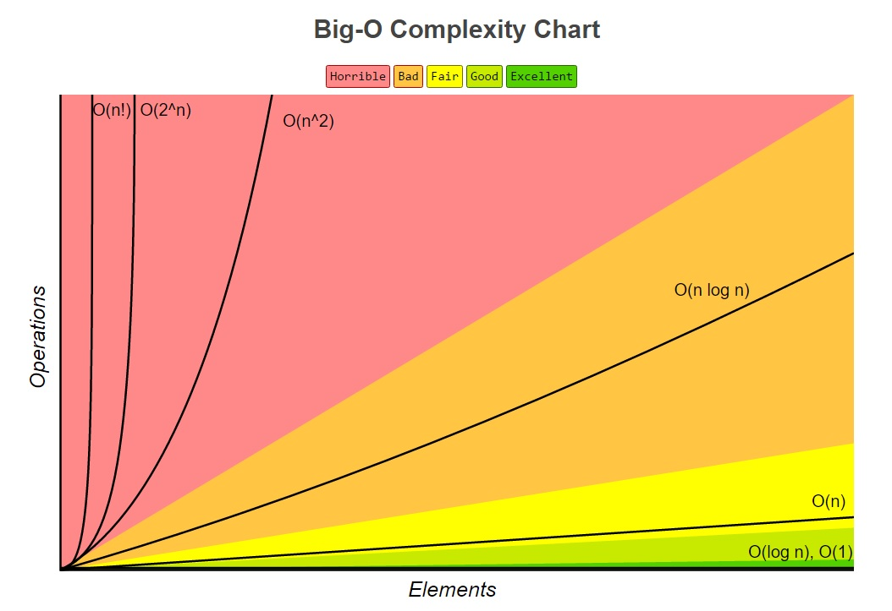

# Sorting algorithms

#### In-place sorting

Some sorting algorithms need additional data structures for comparison or to store elements temporarily.
These algorithms are so called not-in-place sorting algorithms. For example the [Mergesort](mergesort) is
a not-in-place algorithm. On the other side there are in-place algorithms like [Bubblesort](bubblesort) or
[Quicksort](quicksort) which don't need any additional data structures.

#### Stable sorting

If the sorting algorithm doesn't change the order of equal content in the sorted output, it's called stable
sorting. The [Mergesort](mergesort) is a stable sorting algorithm unlike [Quicksort](quicksort) which may
change the order of similar content.

#### Adaptive sorting

An algorithm is adaptive if it takes advantage of already sorted elements and doesn't try to sort it a second
time. Our implementation of the [Bubblesort](bubblesort) is adaptive, because the limit of the outer iteration
decreases itself with each turn. Bad implementation would be if the [Bubblesort](bubblesort) would compare all
elements n times and not just the yet unsorted ones.

#### Big-O Complexity

Each sorting algorithm has a different complexity and is suited best for a specific case. There are several
worst-case scenarios for algorithms like already sorted input for a [Quicksort](quicksort) where the pivot is
either the first or the last element of the array. If the input is mostly sorted, then the normally slow
[Bubblesort](bubblesort) would be quit as fast as the [Quicksort](quicksort).

